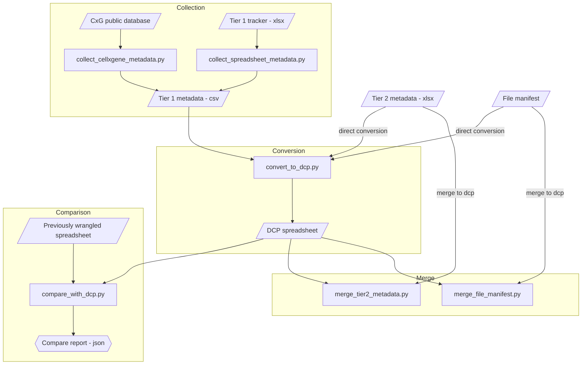

# HCA - Tier 1 to DCP
Convert Human Cell Atlas Tier 1 metadata extracted out of an anndata object of a published CELLxGENE dataset,into [HCA DCP metadata schema](https://github.com/HumanCellAtlas/metadata-schema/tree/master/json_schema) ingestible [spreadsheet](https://github.com/ebi-ait/geo_to_hca/tree/master/template). The vice versa conversion is done with [https://github.com/ebi-ait/hca-dcp-to-tier1]([url](https://github.com/ebi-ait/hca-dcp-to-tier1)).

## Algorithm


This process is done in the following steps (user only call the [wrapper](hca-tier1-to-dcp.py) or individual scripts, detailed steps are there to explain the under the hood processes).
1. Pull data from CxG [collect_cellxgene_metadata.py](collect_cellxgene_metadata.py) or spreadsheet [collect_spreadsheet_metadata.py](collect_spreadsheet_metadata.py)
    - from CxG
    1. Given a collection_id, select dataset and download h5ad
    1. Pull obs and uns layer into csv files in `metadata` dir with `<collection_id>_<dataset_id>` or `<dataset_label>` prefix in `_metadata.csv`, `_study_metadata.csv` and `_cell_obs.csv` filenames
    1. Test if DOI exists in [ingest](https://contribute.data.humancellatlas.org/) (ingest-token required)
    - from spreadsheet
    1. Given a Tier 1 spreadsheet, pull label from filename
    1. Flatten the tier 1 metadata into a csv in `metadata` dir with `<label>_metadata.csv`
1. Convert to DCP spreadsheet [convert_to_dcp.py](convert_to_dcp.py)
    1. Given a spreadsheet path, pull metadata & extract filename label used.
    1. Based on [hca_template.xlsx](https://github.com/ebi-ait/geo_to_hca/raw/master/template/hca_template.xlsx), using the [mapping](helper_files/constants/tier1_mapping.py) convert to dcp flat metadata file with dcp programmatic fields
    1. Based on the field programmatic name, the dcp spreadsheet is populated
    1. If tier 2 and/ or file manifest is given, produce result via dcp_flat
    1. Exported into an xlsx file in `metadata` dir to `<label>_dcp.csv` filename
1. Compare previously wrangled spreadsheet vs tier 1 [compare_with_dcp.py](compare_with_dcp.py)
    1. Open converted and previously wrangled DCP spreadsheet
    1. Compare number of tabs, use intersection
    1. On each common tab 
        1. Compare number of entites per tab
        1. Compare ids per tab, for intersection
        1. Compare values of entities with same IDs (except protocols)
    1. Export all comparison in a report json file in `report_compare` dir to `<label>_compare.json` filename
1. Merge Tier 2 metadata into pre-filled DCP spreadsheet [merge_tier2_metadata.py](merge_tier2_metadata.py)
    1. Open Tier 2 spreadsheet and wrangled DCP spreadsheet
    1. Flatten Tier 2 spreadsheet into a single denormalised tab
    1. Rename columns using [tier 2 mapping](helper_files/constants/tier2_mapping.py)
    1. Merge tier 2 metadata in corresponding tabs/entities of dcp spreadsheet.
    1. Export into an xlsx file in `metadata` dir to `<label>_tier2.xlsx`
1. Merge File metadata into pre-filled DCP spreadsheet [merge_file_manifest.py](merge_file_manifest.py)
    1. Open File metadata tab, Tier 1 metadata and wrangled DCP spreadsheet
    1. Merge File metadata tab into wrangled spreadsheet `Sequence tab` (remove existing & use [FILE_MANIFEST_MAPPING](helper_files/constants/file_mapping.py))
    1. Add standard FASTQ fields [FASTQ_STANDARD_FIELDS](helper_files/constants/file_mapping.py)
    1. Use Tier 1 metadata to assign sequqnce and library prep protocols, and other [TIER_1_MAPPING](helper_files/constants/file_mapping.py) fields
    1. Export into an xlsx file in `metadata` dir to `<label>_fastqed.xlsx`


## Usage
Tested in python3.9. To run scripts you can run:
```bash
python3 -m pip install -r requirements.txt
python3 collect_cellxgene_metadata.py -c <collection_id> -t <ingest-token>
python3 collect_spreadsheet_metadata.py -t1 <tier1_spreadsheet>
python3 convert_to_dcp.py -ft <flat_tier1_spreadsheet> (-t2 <tier2_metadata>) (-fm <file_manifest>)
python3 compare_with_dcp.py -dt <dcp_tier1_spreadsheet> -w <wrangled_spreadsheet>
python3 merge_tier2_metadata.py -t2 <tier2_metadata> -dt <dt_spreadsheet>
python3 merge_file_manifest.py -fm <file_manifest> -dt <dt_spreadsheet> -t1 <tier1_spreadsheet>
```

Alternatively, you can use the [hca-tier1-to-dcp.py](hca-tier1-to-dcp.py) script to run all scripts at once (**c**ollect, **c**onvert, **c**ompare, **m**erge tier 2, **m**erge file manifest). There is also the functionality to run for multiple collections, using a separate csv file for the IDs & wrangled spreadsheets path.
```bash
python3 hca-tier1-to-dcp.py -l test -t1 tier1.xlsx
or
python3 hca-tier1-to-dcp.py -l test -t1 tier1.xlsx -fm file_manifest.xlsx -t2 tier2.xlsx -w pre-wrangled.xlsx
```

### Arguments
- `--collection_id` or `-c`: Collection id (uuid) of the collection to download file from
- `--dataset_id` or `-d`: Dataset id (uuid) of the file to download
- `--dataset-label` or `-l`: Label to use instead of collection/ dataset ids
- `--output_dir` or `-o`: Directory for the output files
- `--ingest_token` or `-t`: [Ingest](https://contribute.data.humancellatlas.org/) token to query for existing projects with same DOI
- `--tier1_spreadsheet` or `-t1`: Submitted tier 1 spreadsheet file path
- `--flat_tier1_path` or `-ft`: Flattened tier 1 spreadsheet path
- `--local_template` or `-lt`: Local path of the [hca_template.xlsx](https://github.com/ebi-ait/geo_to_hca/raw/master/template/hca_template.xlsx)
- `--dcp-tier1-spreadsheet` or `-dt`: DCP formated tier 1 spreadsheet path
- `--wrangled_spreadsheet` or `-w`: Previously wrangled project spreadsheet path
- `--unequal_comparisson` or `-u`: Automaticly continue comparing even if biomaterials are not equal
- `--file_manifest` or `-fm`: File manifest path
- `--tier2_metadata` or `-t2`: Tier 2 spreadsheet file path

#### Requirement of arguments per script
**R**: Required
**o**: optional
| args | [collect CxG](collect_cellxgene_metadata.py) | [collect excel](collect_cellxgene_metadata.py) | [convert](convert_to_dcp.py) | [compare](compare_with_dcp.py) | [merge T2](merge_tier2_metadata.py) | [merge file manifest](merge_file_manifest.py) |
| ---- | ---------- | ---------- | ---------- | ------ | ------ | ------ | 
| `--collection_id`, `-c` | R |  |  |  |  | 
| `--dataset_id`, `-d` | o |  |  |  |  | 
| `--dataset-label`, `-l` | o |  |  |  |  | 
| `--output_dir`, `-o` | o | o | o |  | o | o
| `--ingest_token`, `-t` | o |  |  |  |  | 
| `--tier1_spreadsheet`, `-t1` |  | R |  |  |  | R
| `--flat_tier1_path`, `-ft` |  |  | R |  |  | 
| `--local_template`, `-lt` |  |  | o |  |  | 
| `--dcp-tier1-spreadsheet`, `-dt` |  |  |  | R | R | R
| `--wrangled_spreadsheet`, `-w` |  |  |  | R |  | 
| `--unequal_comparisson`, `-u` |  |  |  | o |  | 
| `--file_manifest`, `-fm` |  |  | o |  |  | R
| `--tier2_metadata`, `-t2` |  |  | o |  | R | 
